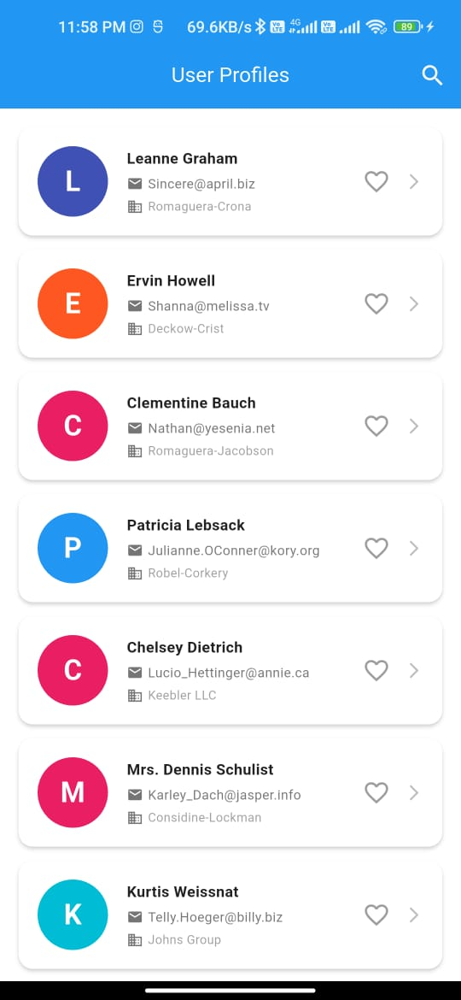

# Usesr Profiles

A Flutter application that fetches and displays user data from a REST API with a beautiful, intuitive interface.

## 📱 Screenshots

### Splash Screen

### User List

### User Detail

### Search

### No result found while searching

---

## ✨ Features

### Core Features
- ✅ **User List Display**: Shows all users with name, email, and company information
- ✅ **Shimmer Loading Animation**: Beautiful skeleton loader while fetching data
- ✅ **List Animations**: Smooth fade-in / slide-up animations when loading items
- ✅ **Pull-to-Refresh**: Swipe down to refresh the user list
- ✅ **Error Handling**: Comprehensive error handling with user-friendly messages
- ✅ **Responsive UI**: Clean and modern Material Design interface

### Bonus Features
- ✅ **Search Functionality**: Real-time search with **polished UI** to filter users by name, email, or username
- ✅ **Favorite Button**: Mark/unmark users as favorites and visually distinguish them
- ✅ **Shimmer Loading Animation**: Modern placeholder shimmer effect while fetching user data
- ✅ **Detail Screen**: Comprehensive user detail page showing complete information including:
  - Contact information (email, phone, website)
  - Full address with coordinates
  - Company details
- ✅ **Splash Screen**: Animated splash screen on app launch
- ✅ **Custom Widgets**: Modular, reusable widget architecture
- ✅ **Hero Animations**: Smooth transitions between list and detail screens

---

## 🏗️ Architecture

The app follows a clean architecture pattern with clear separation of concerns:

lib/
├── main.dart # App entry point
├── models/
│ └── user.dart # User data models
├── services/
│ └── api_service.dart # HTTP API calls
├── repositories/
│ └── user_repository.dart # Data layer abstraction
├── viewmodels/
│ └── user_view_model.dart # Business logic and state management
├── views/
│ ├── splash_screen.dart # Splash screen
│ ├── user_list_screen.dart # Main user list screen
│ └── user_detail_screen.dart # User detail screen
└── widgets/
├── user_tile.dart # Reusable user list item widget

---

## 🛠️ Technical Stack

- **Flutter**: Latest stable version (3.x)
- **State Management**: Provider
- **HTTP Client**: http package
- **Design**: Material Design 3
- **API**: JSONPlaceholder (https://jsonplaceholder.typicode.com/users)
- **Animations**: Hero, FadeIn, SlideUp
- **Loader**: Shimmer

## 📦 Dependencies

dependencies:
  flutter:
    sdk: flutter
  http: ^1.1.0
  provider: ^6.0.5
  shimmer: ^3.0.0
  cupertino_icons: ^1.0.2
🚀 Getting Started
Prerequisites
Flutter SDK (3.0.0 or higher)

Dart SDK (3.0.0 or higher)

Android Studio / VS Code with Flutter extensions

Android Emulator / iOS Simulator / Physical Device

Installation
Clone the repository

🎯 Design Decisions
State Management
Provider chosen for simplicity and scalability

Keeps UI reactive and business logic separate

Architecture Pattern
MVVM (Model-View-ViewModel) for separation of concerns

Repository pattern to abstract data sources

Service layer for API calls

Error Handling
Comprehensive try-catch blocks in API service

User-friendly error messages for network, timeout, and server errors

Retry functionality on error screens

UI/UX Improvements
Shimmer Loader instead of plain progress indicator

List Animations (fade-in & slide-up) for smooth UX

Favorites for user bookmarking

Polished Search Bar with clear button & live filtering

Material Design 3 colors & typography

📝 API Integration
The app uses the JSONPlaceholder API:

Endpoint: https://jsonplaceholder.typicode.com/users

Method: GET

Response: JSON array of user objects

📱 Features Walkthrough
1. Splash Screen
Animated logo with fade/scale effects

3-second display duration

Smooth transition to main screen

2. User List Screen
User cards with avatar, name, email, and company

Shimmer animation while fetching

List fade-in animations when loaded

Pull down to refresh

3. Favorites
Tap favorite button to toggle

Favorites visually highlighted

4. Search Functionality
Modern search UI inside app bar

Real-time filtering across name, email, username

Clear button to reset search

5. User Detail Screen
Full user profile (contact, address, company)

Hero animation for avatar transition

6. Error Handling
Handles network/server errors gracefully

Retry button on error state

👨‍💻 Author
Shamsheer Sha

GitHub: @shamsheer_sha

